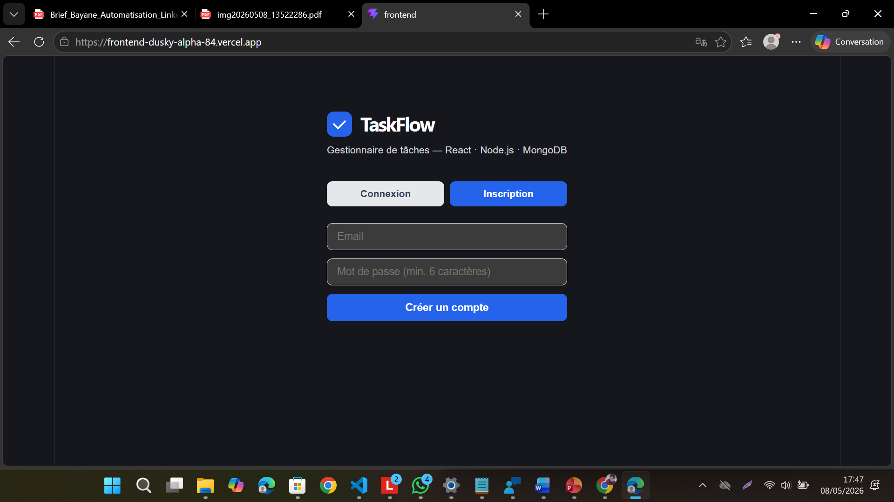
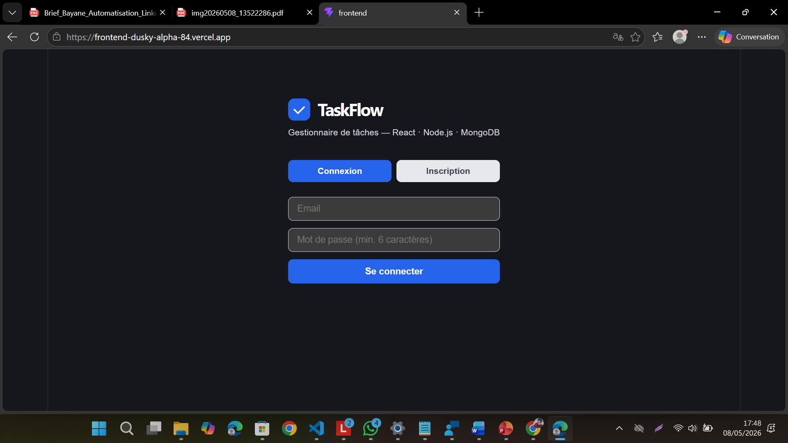

# TaskFlow

> Gestionnaire de tâches fullstack — React · Node.js · MongoDB · Jest · Cypress · Sentry

**Live demo** : https://frontend-dusky-alpha-84.vercel.app

Built with **React + Vite** (frontend) · **Node.js + Express + MongoDB** (backend) · **Jest** (unit tests) · **Cypress** (E2E tests) · **Sentry** (monitoring)

---

## Screenshots

### Inscription


### Connexion


### Gestionnaire de tâches


---

## Stack

| Côté | Technologies |
|---|---|
| Frontend | React 19 · Vite · @sentry/react |
| Backend | Node.js · Express · Mongoose · @sentry/node |
| Base de données | MongoDB Atlas |
| Tests unitaires | Jest · Supertest |
| Tests E2E | Cypress |
| Monitoring | Sentry (frontend + backend) |
| Deploy | Vercel (front) · Railway (back) |

---

## Fonctionnalités

- Ajouter une tâche
- Marquer une tâche comme done
- Supprimer une tâche
- API REST Node.js + MongoDB
- Tests unitaires Jest (GET, POST, PATCH, DELETE)
- Tests E2E Cypress (parcours utilisateur complet)
- Monitoring Sentry intégré frontend + backend

---

## Installation

### Backend

```bash
cd backend
npm install
cp .env.example .env
# Remplir MONGO_URI et SENTRY_DSN dans .env
npm run dev
```

### Frontend

```bash
cd frontend
npm install
cp .env.example .env
# Remplir VITE_API_URL et VITE_SENTRY_DSN dans .env
npm run dev
```

---

## Tests

### Jest (unitaires — backend)

```bash
cd backend
npm test
```

### Cypress (E2E — frontend)

```bash
cd frontend
npm run cy:open   # mode interactif
npm run cy:run    # mode headless CI
```

---

## Variables d'environnement

### backend/.env

```
PORT=3001
MONGO_URI=mongodb+srv://...
SENTRY_DSN=https://...
```

### frontend/.env

```
VITE_API_URL=http://localhost:3001
VITE_SENTRY_DSN=https://...
```

---

Développé par **Bayane Miguel Singcol** · 2026
